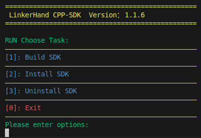
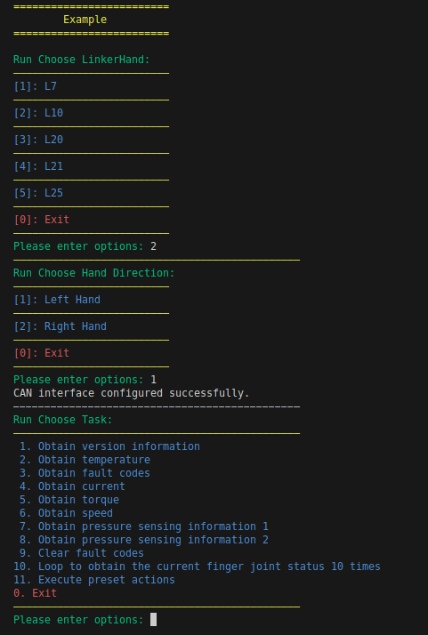

# LinkerHand-CPP-SDK

**[English](README.md)** | **[中文](README_CN.md)**

## Overview

LinkerHand-CPP-SDK is developed by Linkerbot (Beijing) Technology Co., Ltd. It provides driver software and demo examples for O6, L6, L7, L10, L20, L21, and L25 series dexterous hands.

## Installation

### Windows

System: Windows 11 64-bit

Environment: cmake 4.0.3, MinGW x86_64 15.1.0

- Download SDK

```bash
git clone https://github.com/linkerbotai/linker_hand_cpp_sdk.git
```

- Build:

    - 1. Copy linker_hand_cpp_sdk/linker_hand/third_party/PCAN_Basic/x64/PCANBasic.dll to C:\Windows\System32 directory

    - 2. Copy linker_hand_cpp_sdk/linker_hand/third_party/Robotic_Arm/windows/win_mingw64_c++_v1.1.0/libapi_cpp.dll to C:\Windows\System32 directory

```bash
cd linker_hand_cpp_sdk/linker_hand
mkdir build
cd build
cmake -G "MinGW Makefiles" ..
cmake --build .
```

- Run Example

```bash
./linker_hand_example.exe
```

### Ubuntu

- Download SDK

```bash
git clone https://github.com/linkerbotai/linker_hand_cpp_sdk.git
```

- Run Script
```bash
cd linker_hand_cpp_sdk/linker_hand
./script.sh
```

- Run Example

```bash
cd build
./linker_hand_example
```

 

## Quick Start

- Create main.cpp file and add the following code:

```cpp
// main.cpp
#include "LinkerHandApi.h"

int main() {

    // Call API interface
    LinkerHandApi hand(LINKER_HAND::L10, HAND_TYPE::RIGHT);

    // Get version info
    std::cout << hand.getVersion() << std::endl;

    // Make a fist
    std::vector<uint8_t> fist_pose = {101, 60, 0, 0, 0, 0, 255, 255, 255, 51};
    hand.fingerMove(fist_pose);
    std::this_thread::sleep_for(std::chrono::seconds(1));

    // Open hand
    std::vector<uint8_t> open_pose = {255, 104, 255, 255, 255, 255, 255, 255, 255, 71};
    hand.fingerMove(open_pose);
    std::this_thread::sleep_for(std::chrono::seconds(1));

    return 0;
}
```

- Create CMakeLists.txt file and add the following configuration:

```cmake
# CMakeLists.txt
cmake_minimum_required(VERSION 3.5)
project(MyProject)

# Find LINKER_HAND_LIB library
find_library(LINKER_HAND_LIB
    NAMES linker_hand_lib
    PATHS /usr/local/linker_hand_cpp_sdk/lib
    NO_DEFAULT_PATH
)

# Find RMAN_API_LIB library
find_library(RMAN_API_LIB
    NAMES api_cpp
    PATHS /usr/local/linker_hand_cpp_sdk/third_party/Robotic_Arm/lib
    NO_DEFAULT_PATH
)

# Include directories
include_directories(
	include
	/usr/local/linker_hand_cpp_sdk/include
	/usr/local/linker_hand_cpp_sdk/third_party/Robotic_Arm/include
)

# Add executable
add_executable(my_project main.cpp)

# Link libraries
target_link_libraries(my_project ${LINKER_HAND_LIB} ${RMAN_API_LIB} pthread)
  ```

```
  🔧 Core SDK Directory (linker_hand/)

  linker_hand/
  ├── include/                   # Public headers (18 files)
  │   ├── LinkerHandApi.h       # ⭐ Main API facade (entry point)
  │   ├── Common.h              # Enums: LINKER_HAND, HAND_TYPE, COMM_TYPE
  │   ├── IHand.h               # Abstract hand interface
  │   ├── HandFactory.h         # Factory pattern
  │   ├── LinkerHandL6.h        # L6 model
  │   ├── LinkerHandL7.h        # L7 model
  │   ├── LinkerHandL10.h       # L10 model
  │   ├── LinkerHandL20.h       # L20 model
  │   ├── LinkerHandL25.h       # L25 model
  │   ├── ICommunication.h      # Communication interface abstraction
  │   ├── ICanBus.h             # CAN interface
  │   ├── CanBus.h              # Linux SocketCAN
  │   ├── CanBusFactory.h       # CAN bus factory
  │   ├── CanFrame.h            # CAN frame definition
  │   ├── PCANBus.h             # Windows PCAN
  │   ├── EtherCAT.h            # EtherCAT communication
  │   ├── ModBus.h              # ModBus communication
  │   ├── ModbusLinkerHandL10.h # L10 ModBus specific
  │   └── RangeToArc.h          # Position value <-> radian conversion
  │
  ├── src/                       # Source code implementation (12 files)
  │   ├── LinkerHandApi.cpp
  │   ├── LinkerHandL6.cpp
  │   ├── LinkerHandL7.cpp
  │   ├── LinkerHandL10.cpp
  │   ├── LinkerHandL20.cpp
  │   ├── LinkerHandL25.cpp
  │   ├── CanBus.cpp
  │   ├── PCANBus.cpp
  │   ├── EtherCAT.cpp
  │   ├── ModBus.cpp
  │   ├── ModbusLinkerHandL10.cpp
  │   └── RangeToArc.cpp
  │
  ├── user_test/                 # ⭐ User hardware test tools (6 files)
  │   ├── linker_hand_user_test.cpp  # Main entry
  │   ├── test_common.h              # Common definitions
  │   ├── test_environment.cpp       # Environment detection
  │   ├── test_connection.cpp        # Connection test
  │   ├── test_basic_function.cpp    # Basic function test
  │   ├── test_motion.cpp            # Motion test
  │   └── test_sensors.cpp           # Sensor test
  │
  ├── examples/                  # Example programs
  │   ├── Examples.cpp          # Comprehensive examples
  │   ├── test.cpp              # Development test
  │   ├── test_l7.cpp           # L7 test
  │   ├── Demo_ModbusRTU.cpp    # ModBus RTU demo
  │   ├── L10/
  │   │   └── action_group_show.cpp
  │   ├── range_to_arc/
  │   │   ├── range_to_arc.cpp
  │   │   └── README.md
  │   └── ModbusRTU/            # Standalone ModBus project
  │       ├── CMakeLists.txt
  │       ├── main.cpp
  │       └── run.sh
  │
  ├── config/
  │   └── setting.yaml          # ⭐ Hand model/sensor configuration
  │
  ├── third_party/
  │   ├── PCAN_Basic/           # Windows PCAN driver
  │   │   ├── Include/          # Multi-language headers
  │   │   └── x64/              # DLL + LIB
  │   └── Robotic_Arm/          # Realman robotic arm library
  │       ├── include/
  │       ├── linux/lib/
  │       └── windows/
  │
  ├── docs/
  │   └── API-Reference.md
  ├── img/
  ├── CMakeLists.txt
  └── script.sh
```
- Build
```bash
cd example
mkdir build
cd build
cmake ..
make
```
- Run

```bash
./my_project
```

- Position and Finger Joint Mapping Table

```
L6/O6: ["Thumb Bend", "Thumb Lateral", "Index Bend", "Middle Bend", "Ring Bend", "Pinky Bend"]

L7:  ["Thumb Bend", "Thumb Lateral", "Index Bend", "Middle Bend", "Ring Bend", "Pinky Bend", "Thumb Rotation"]

L10: ["Thumb Root", "Thumb Lateral", "Index Root", "Middle Root", "Ring Root", "Pinky Root", "Index Lateral", "Ring Lateral", "Pinky Lateral", "Thumb Rotation"]

L20: ["Thumb Root", "Index Root", "Middle Root", "Ring Root", "Pinky Root", "Thumb Lateral", "Index Lateral", "Middle Lateral", "Ring Lateral", "Pinky Lateral", "Thumb Roll", "Reserved", "Reserved", "Reserved", "Reserved", "Thumb Tip", "Index Tip", "Middle Tip", "Ring Tip", "Pinky Tip"]

L21: ["Thumb Root", "Index Root", "Middle Root", "Ring Root", "Pinky Root", "Thumb Lateral", "Index Lateral", "Middle Lateral", "Ring Lateral", "Pinky Lateral", "Thumb Roll", "Reserved", "Reserved", "Reserved", "Reserved", "Thumb Middle", "Reserved", "Reserved", "Reserved", "Reserved", "Thumb Tip", "Index Tip", "Middle Tip", "Ring Tip", "Pinky Tip"]

L25: ["Thumb Root", "Index Root", "Middle Root", "Ring Root", "Pinky Root", "Thumb Lateral", "Index Lateral", "Middle Lateral", "Ring Lateral", "Pinky Lateral", "Thumb Roll", "Reserved", "Reserved", "Reserved", "Reserved", "Thumb Middle", "Index Middle", "Middle Middle", "Ring Middle", "Pinky Middle", "Thumb Tip", "Index Tip", "Middle Tip", "Ring Tip", "Pinky Tip"]
```

## Examples

| No.  | File Name | Description                                              |
| :--- | :-------- | :------------------------------------------------------- |
| 1    | Examples  | Example collection (supports L7, L10, L20, L21, L25 dexterous hands) |
| 2    | ModbusRTU | Only supports L10 model dexterous hand (4th gen Realman arm) |

## API Documentation

- [C++ API Documentation](linker_hand/docs/API-Reference.md)

## Version Updates
